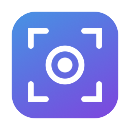

<p align="center">
  
</p>

<h1 align="center">MScreenshot</h1>

<p align="center">Native macOS screenshots with a built-in annotation editor.</p>

MScreenshot is a menu bar app for macOS (14+) written in Swift/AppKit with no external dependencies. Take captures by selection, window or full screen, and annotate them — blur, text, arrows and more — before saving.

## Features

- **Capture modes**: rectangular selection, application window and full screen.
- **In-place editing**: selection captures open an editor right on top of the captured region, with a floating toolbar. Press `Return` to save, `Esc` to discard, or pop it out into a full editor window.
- **Automatic clipboard**: every capture is copied to the clipboard the moment it is taken (and again with your annotations when you save). Can be disabled in Settings.
- **Global shortcuts** (fully configurable in Settings):
  | Default | Action |
  |---|---|
  | `⌃⇧3` | Full screen |
  | `⌃⇧4` | Selection |
  | `⌃⇧5` | Window |
- **Annotation editor**:
  - **Blur** a region — rectangular, circular or freeform (lasso).
  - **Text** with multiple fonts (System, Helvetica Neue, Georgia, Menlo, Marker Felt…) and sizes.
  - Pointing tools: arrow, line, rectangle, ellipse, highlighter and numbered badges (1, 2, 3…).
  - Color and line-width pickers, undo/redo, zoom (pinch or `⌘` + scroll), centered preview.
- **Settings**: destination folder, format (PNG/JPEG), filename prefix, open editor after capture, clipboard copy, capture sound, window shadow, launch at login and keyboard shortcuts.

## Installation

1. Download the `.zip` from the [latest release](../../releases/latest).
2. Unzip and move `MScreenshot.app` to `/Applications`.
3. The app is not notarized, so on first run either right-click → **Open**, or run:
   ```bash
   xattr -dr com.apple.quarantine /Applications/MScreenshot.app
   ```
4. On the first capture, macOS will ask for **Screen Recording** permission in
   *System Settings → Privacy & Security*. Grant it and relaunch the app.

## Building from source

```bash
git clone https://github.com/richardogcc/MScreenshot.git
cd MScreenshot
./scripts/install.sh   # builds, installs into /Applications and launches
```

When building from source, run `./scripts/setup_signing.sh` once first: it creates a stable self-signed code-signing identity so macOS permissions (Screen Recording) survive app updates. Without it, builds are ad-hoc signed and macOS asks for permissions again after every update.

Available scripts:

- `scripts/build_app.sh` — builds `build/MScreenshot.app` (universal arm64 + x86_64 binary).
- `scripts/setup_signing.sh` — one-time creation of the local signing identity.
- `scripts/install.sh` — builds, replaces the installed version and launches the app.
- `scripts/release.sh` — builds, zips and publishes a GitHub release (requires `gh`).
- `scripts/make_icon.swift` — regenerates the icon (`Resources/AppIcon.icns`).

## License

[MIT](LICENSE) © 2026 richardogcc
